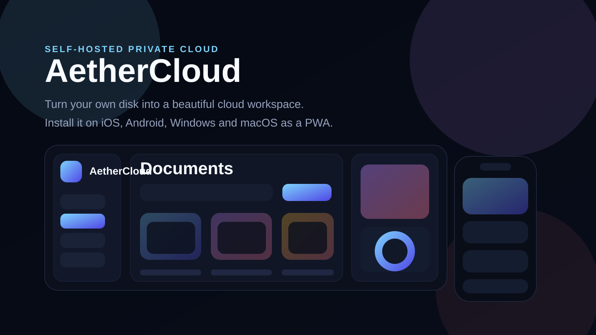

# AetherCloud



Self-hosted cloud storage that turns your own machine and attached disk into a polished private workspace.

## What changed

- The project is now structured as a real Flask package in [`aethercloud`](aethercloud).
- The old inline HTML monolith was replaced with templates and static assets.
- `/` is now a product landing page.
- `/register`, `/login`, `/forgot` are dedicated auth routes.
- `/cloud` was redesigned into a more product-style dashboard inspired by the supplied references.
- The web client is now installable as a PWA on iOS, Android, Windows and macOS.
- A GitHub Pages-ready static presentation lives in [`docs/`](docs).

## Stack

- Backend: Flask + SQLite
- Storage: local filesystem or mounted external disk
- Frontend: Flask templates + custom CSS/JS
- App distribution: installable PWA
- Deployment: Python, Gunicorn or Docker Compose
- License: MIT

## Features

- registration, login and password reset
- personal root workspace per user
- nested folders
- multiple file upload and directory upload
- file preview for images plus generated preview badges for other file types
- personal storage meter and quota
- profile and password settings
- admin overview for `miri.saro@bk.ru`
- landing page and GitHub Pages presentation

## Quick start

### Python

```bash
python -m venv .venv
source .venv/bin/activate
pip install -r requirements.txt
python AetherCloud.py
```

Open `http://127.0.0.1:5000/`.

For Windows there is a ready launcher:

```powershell
.\scripts\start-windows.ps1 -StorageRoot "E:\AetherCloudData"
```

### Docker Compose

```bash
cp .env.example .env
docker compose up -d
```

Default container volume:

```text
./data:/data
```

Windows external disk example:

```text
E:/AetherCloudData:/data
```

## Environment

| Variable | Purpose |
| --- | --- |
| `AETHER_SECRET_KEY` | Flask session secret |
| `AETHER_DB_PATH` | SQLite file path |
| `AETHER_STORAGE_DIR` | blob storage directory |
| `AETHER_TOTAL_STORAGE_GB` | total shared pool size |
| `AETHER_MAX_UPLOAD_MB` | request size limit |
| `AETHER_HOST` | bind host |
| `AETHER_PORT` | bind port |
| `AETHER_TUNA_URL` | optional public URL shown in the UI |
| `AETHER_DEBUG` | debug mode for local runs |

## Windows disk setup

For a Windows host with a dedicated disk:

```powershell
$env:AETHER_DB_PATH = "E:\AetherCloudData\users.db"
$env:AETHER_STORAGE_DIR = "E:\AetherCloudData\storage"
$env:AETHER_SECRET_KEY = "change-this-secret"
$env:AETHER_PORT = "5000"
python AetherCloud.py
```

## Routes

- `/` - landing page
- `/register` - create account
- `/login` - sign in
- `/forgot` - reset password
- `/cloud` - main workspace
- `/admin` - admin console
- `/health` - simple health endpoint

## GitHub page

The repository now contains a static presentation in [`docs/index.html`](docs/index.html).

To publish it with GitHub Pages:

1. Push the repository to GitHub.
2. Open repository settings.
3. Enable GitHub Pages from the `docs/` folder on your default branch.

The repo now also contains:

- CI workflow: [.github/workflows/ci.yml](.github/workflows/ci.yml)
- Pages deploy workflow: [.github/workflows/pages.yml](.github/workflows/pages.yml)

## Tests

```bash
python -m unittest discover -s tests -p "test_*.py" -v
```

## License

This project is released under the [MIT License](LICENSE).

## Security notes

- This is a self-hosted storage app, not a zero-trust encrypted vault.
- Put it behind HTTPS if you want access from outside your local network.
- Replace the default secret key before exposing it publicly.
