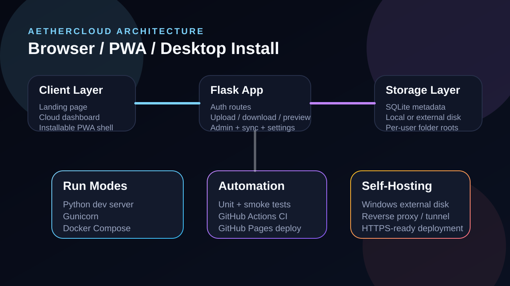

<div align="center">
  
  <h1>AetherCloud</h1>
  <p><strong>Self-hosted cloud storage from your own disk.</strong></p>
  <p>
    Turn a Windows drive, local SSD or mounted volume into a clean private cloud
    with a polished dashboard, installable PWA and simple deployment story.
  </p>

  <p>
    
    
    
    
    
  </p>
</div>


## Overview

AetherCloud is a self-hosted Flask application that lets you run a personal cloud workspace on your own machine.
The project is built around a simple model:

- `SQLite` stores metadata
- the local filesystem stores uploaded files
- the web UI acts as both a browser app and an installable PWA
- deployment works with plain Python, `gunicorn` or Docker Compose

That makes it practical for:

- a Windows PC with a dedicated storage drive
- a home server or mini-PC
- a private family workspace
- a personal design / documents / media cloud

## Highlights

- modern landing page and dark dashboard UI inspired by your references
- registration, login and password reset
- nested folders with personal root workspace
- file upload, folder upload and download
- image previews plus generated file-type badges
- storage meter, per-user quota calculation and recent files
- sync check between metadata and real disk files
- admin overview for `miri.saro@bk.ru`
- installable PWA for iOS, Android, Windows and macOS
- GitHub Pages-ready public promo page in [`docs/`](docs)
- CI and Pages deployment workflows in [`.github/workflows`](.github/workflows)

## Screens

| Landing | Architecture |
| --- | --- |
|  |  |

## Architecture

```text
Client / PWA
  -> Flask routes and templates
  -> SQLite metadata
  -> Local disk or external mounted volume
```

Main application code lives in:

- [`aethercloud/app.py`](aethercloud/app.py)
- [`aethercloud/templates`](aethercloud/templates)
- [`aethercloud/static`](aethercloud/static)

Runtime entrypoints:

- dev entrypoint: [`AetherCloud.py`](AetherCloud.py)
- production entrypoint: [`wsgi.py`](wsgi.py)

## Quick Start

### 1. Run locally with Python

```bash
python3 -m venv .venv
source .venv/bin/activate
pip install -r requirements.txt
python AetherCloud.py
```

Open:

- `http://127.0.0.1:5000/`

### 2. Run with Docker Compose

```bash
cp .env.example .env
docker compose up -d
```

Default volume:

```text
./data:/data
```

Windows external disk example:

```text
E:/AetherCloudData:/data
```

### 3. Run with helper scripts

Windows:

```powershell
.\scripts\start-windows.ps1 -StorageRoot "E:\AetherCloudData"
```

Linux / macOS:

```bash
./scripts/start-linux.sh /Volumes/AetherDrive
```

### 4. Use `make`

```bash
make install
make test
make dev
```

## Self-Hosting On Windows

If your main idea is to use a disk on your Windows machine as the actual cloud storage, set these paths explicitly:

```powershell
$env:AETHER_DB_PATH = "E:\AetherCloudData\users.db"
$env:AETHER_STORAGE_DIR = "E:\AetherCloudData\storage"
$env:AETHER_SECRET_KEY = "change-this-secret"
$env:AETHER_HOST = "0.0.0.0"
$env:AETHER_PORT = "5000"
$env:AETHER_DEBUG = "0"
python AetherCloud.py
```

Then expose it with one of these options:

- local network only
- reverse proxy with HTTPS
- tunnel service to a public URL

## Environment Variables

| Variable | Purpose |
| --- | --- |
| `AETHER_SECRET_KEY` | Flask session secret |
| `AETHER_DB_PATH` | SQLite database path |
| `AETHER_STORAGE_DIR` | binary storage root |
| `AETHER_TOTAL_STORAGE_GB` | total shared storage pool |
| `AETHER_MAX_UPLOAD_MB` | maximum request size |
| `AETHER_HOST` | bind host |
| `AETHER_PORT` | bind port |
| `AETHER_TUNA_URL` | optional public URL shown in UI |
| `AETHER_DEBUG` | enable or disable Flask debug mode |

See [`.env.example`](.env.example) for the default shape.

## Routes

| Route | Purpose |
| --- | --- |
| `/` | public landing page |
| `/register` | create account |
| `/login` | sign in |
| `/forgot` | reset password |
| `/cloud` | main workspace |
| `/admin` | admin console |
| `/health` | health endpoint |
| `/manifest.webmanifest` | PWA manifest |

## Project Layout

```text
AetherCloud/
├── aethercloud/          # Flask package
│   ├── app.py            # app factory and routes
│   ├── templates/        # landing, auth, cloud, admin
│   └── static/           # css, js, icons, manifest, service worker
├── docs/                 # GitHub Pages site
├── scripts/              # Windows and Linux launch helpers
├── tests/                # smoke and route tests
├── AetherCloud.py        # development entrypoint
├── wsgi.py               # production entrypoint
├── Dockerfile
├── docker-compose.yml
└── Makefile
```

## Quality Gates

Run tests:

```bash
python -m unittest discover -s tests -p "test_*.py" -v
```

GitHub automation included:

- CI: [`.github/workflows/ci.yml`](.github/workflows/ci.yml)
- GitHub Pages deploy: [`.github/workflows/pages.yml`](.github/workflows/pages.yml)

## Publish The Landing Page

The repository contains a static promo page in [`docs/index.html`](docs/index.html).

To publish it:

1. Push the repo to GitHub.
2. Enable GitHub Pages for the repository.
3. Use the default branch.
4. The workflow can deploy the `docs/` site automatically.

## Security Notes

- This is a self-hosted storage product, not an end-to-end encrypted vault.
- Replace the default `AETHER_SECRET_KEY` before public exposure.
- Prefer HTTPS when the app is reachable outside your LAN.
- Keep `AETHER_STORAGE_DIR` outside the repository root in production.

See also [SECURITY.md](SECURITY.md).

## Contributing

Contribution guidance is in [CONTRIBUTING.md](CONTRIBUTING.md).

## License

This project is released under the [MIT License](LICENSE).
